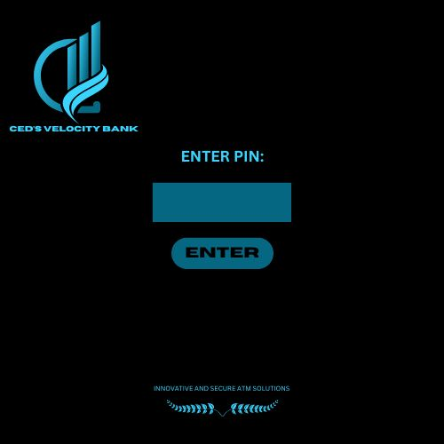
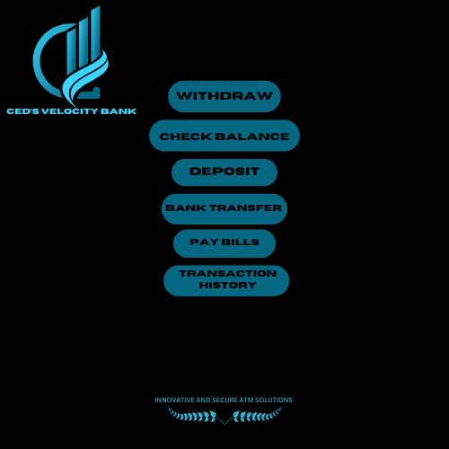

# ATM GUI Application

This project is a **Graphical User Interface (GUI) ATM simulation** created in Java using the **Swing library**. It allows users to perform basic ATM operations such as checking their balance, depositing funds, withdrawing funds, transferring money, paying bills, and viewing transaction history. The application features visually distinct login and main menu panels, each with its own background image for a polished and user-friendly experience.

---

## Features

1. **Login Panel:**
   - Users enter a PIN to access the main ATM functionalities.
   - Uses `1.jpg` as the background for a professional and clean interface.

2. **Main Panel:**
   - After successful login, users can:
     - **Withdraw Funds**: Specify an amount to withdraw, with balance validation.
     - **Check Balance**: View the current account balance in a text area.
     - **Deposit Funds**: Add a specified amount to the balance.
     - **Bank Transfer**: Placeholder functionality for transferring funds to another account.
     - **Pay Bills**: Placeholder functionality for bill payments.
     - **Transaction History**: View a detailed history of all transactions made during the session.
   - Uses `2.jpg` as the background for the main panel to differentiate it from the login screen.

3. **Transaction History:**
   - All completed transactions (withdrawals, deposits, etc.) are logged and displayed in the transaction history section.

4. **User Feedback:**
   - The app provides real-time feedback via dialog boxes for actions such as successful login, invalid PINs, insufficient funds, and invalid inputs.

---

## How It Works

### 1. **Background Images**
- The application dynamically applies background images to different panels:
  - `1.jpg` for the **Login Panel**.
  - `2.jpg` for the **Main Panel**.
- Images are drawn using the `paintComponent` method of custom `JPanel` implementations.

### 2. **Login Functionality**
- Users are required to enter the correct PIN (`1234` by default) to access the main panel.
- If the entered PIN is incorrect, an error message is displayed using a `JOptionPane`.

### 3. **ATM Operations**
- After logging in, the **Main Panel** provides the following options:
  - **Withdraw Funds**: Deducts a user-specified amount from the balance, ensuring the balance does not go negative.
  - **Check Balance**: Displays the current balance in the text area at the bottom of the screen.
  - **Deposit Funds**: Increases the balance by a user-specified amount.
  - **Bank Transfer** and **Pay Bills**: Placeholder functionalities for future development.
  - **Transaction History**: Displays all completed transactions during the session.

### 4. **Transaction Logging**
- Each completed transaction is logged in an `ArrayList<String>` and displayed in the transaction history section.

### 5. **Panel Transitions**
- The application transitions between panels (login and main) using `JPanel` components.
- Upon successful login:
  - The **Login Panel** is removed, and the **Main Panel** is added dynamically to the frame.
- Swing's `revalidate()` and `repaint()` methods are used to refresh the UI after transitions.

---

## Technologies Used

- **Java**: Core programming language.
- **Swing**: For GUI development, including custom panels, buttons, and dialog boxes.
- **ArrayList**: To store transaction history.

---

## How to Run

### Prerequisites
1. Ensure you have **Java JDK 8 or higher** installed on your system.
2. A code editor or IDE such as **IntelliJ IDEA**, **Eclipse**, or **Visual Studio Code** with Java support.

### Steps
1. Clone the repository or download the project files.
2. Place the background images (`1.jpg` and `2.jpg`) in the `src` folder.
3. Open the project in your IDE.
4. Compile and run the `ATM_GUI.java` file.

---

## File Structure

```
ATM_GUI/
│
├── src/
│   ├── 1.jpg               # Background image for the Login Panel
│   ├── 2.jpg               # Background image for the Main Panel
│   └── ATM_GUI.java        # Main application file
│
└── README.md               # Documentation file (this file)
```

---

## How It All Works Together

1. **Login Panel (`1.jpg` Background):**
   - Displays a PIN input field and a login button.
   - Validates user credentials before transitioning to the main menu.

2. **Main Panel (`2.jpg` Background):**
   - Provides the primary ATM functionalities with styled buttons and real-time feedback.
   - Uses logical separation of operations like withdrawals, deposits, and balance checks.

3. **Dynamic Panel Switching:**
   - The application uses dynamic `JPanel` switching to transition between the login and main menus.
   - Each panel uses its own custom `paintComponent` method to draw its background image.

4. **Data Handling:**
   - All transactions are stored in memory using an `ArrayList` for quick access and display.

5. **Error Handling:**
   - Ensures proper error handling for invalid inputs, insufficient funds, and incorrect PINs.

---

## Future Enhancements

- Add functionality for:
  - **Bank Transfers**: Implement inter-account fund transfers.
  - **Bill Payments**: Add real APIs or dummy services for utility payments.
- Encrypt stored PINs for better security.
- Persist transaction history using file storage or a database.

---

## Screenshots

### 1. Login Screen
The login screen with a professional `1.jpg` background:


### 2. Main Menu
The main ATM menu with all functionalities and a clean `2.jpg` background:


---

## Author

Developed by **[Your Name]**.  
Feel free to contribute or report issues to improve this project!
